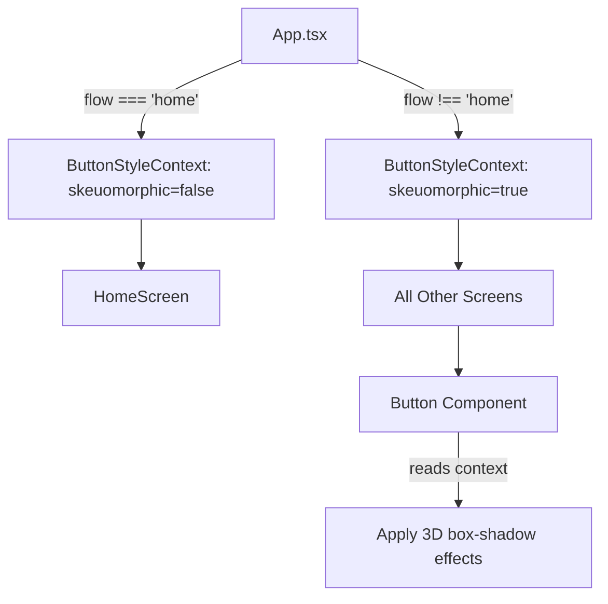

# Skeuomorphic Button Style Implementation

## Current State

- **Button component**: [src/app/ui/Button.tsx](src/app/ui/Button.tsx) - uses Framer Motion with Tailwind CSS, supports variants (primary, secondary, ghost, outline, destructive) and sizes
- **HomeScreen**: [src/app/features/home/HomeScreen.tsx](src/app/features/home/HomeScreen.tsx) - uses custom styled native `<button>` elements (not the Button component), only uses Button component for test buttons
- **styled-components**: Already installed in package.json

## Implementation Approach

Use a React Context to control button styling based on the current flow. When not on the home screen, apply the skeuomorphic 3D effect (box-shadows) to all Button component instances.




## Implementation Steps

### 1. Create ButtonStyleContext

Create [src/app/ui/ButtonStyleContext.tsx](src/app/ui/ButtonStyleContext.tsx):

```tsx
import { createContext, useContext, ReactNode } from 'react';

interface ButtonStyleContextValue {
  skeuomorphic: boolean;
}

const ButtonStyleContext = createContext<ButtonStyleContextValue>({ skeuomorphic: false });

export function ButtonStyleProvider({ skeuomorphic, children }: { skeuomorphic: boolean; children: ReactNode }) {
  return (
    <ButtonStyleContext.Provider value={{ skeuomorphic }}>
      {children}
    </ButtonStyleContext.Provider>
  );
}

export function useButtonStyle() {
  return useContext(ButtonStyleContext);
}
```

### 2. Update Button Component

Modify [src/app/ui/Button.tsx](src/app/ui/Button.tsx) to:

- Import `useButtonStyle` from the context
- Add styled-components wrapper for the skeuomorphic effect
- Apply the 3D box-shadow effects on hover/active/focus when `skeuomorphic` is true

Key changes (preserving existing styles):

- Add hover box-shadow: `0 4px 3px 1px #FCFCFC, 0 6px 8px #D6D7D9, 0 -4px 4px #CECFD1, 0 -6px 4px #FEFEFE, inset 0 0 3px 3px #CECFD1`
- Add active/focus box-shadow: same with additional `inset 0 0 5px 3px #999, inset 0 0 30px #aaa`
- Add subtle gradient background overlay while preserving the existing variant colors

### 3. Wrap App Content with ButtonStyleProvider

Modify [src/app/App.tsx](src/app/App.tsx) to:

- Import `ButtonStyleProvider`
- Wrap content in `ButtonStyleProvider` with `skeuomorphic={state.flow !== 'home'}`

```tsx
<ButtonStyleProvider skeuomorphic={state.flow !== 'home'}>
  {/* existing MobileLayout and content */}
</ButtonStyleProvider>
```

### 4. Add CSS for Skeuomorphic Effects

Add CSS classes in [src/styles/index.css](src/styles/index.css) or use styled-components inline in Button for:

- `.btn-skeuomorphic` class with the 3D shadow effects
- Transition smoothing for the shadow effects

## Files to Modify

- **Create**: `src/app/ui/ButtonStyleContext.tsx` - new context file
- **Modify**: `src/app/ui/Button.tsx` - add skeuomorphic styling support
- **Modify**: `src/app/App.tsx` - wrap with ButtonStyleProvider

## Edge Cases Handled

- HomeScreen buttons remain unchanged (uses native `<button>` elements + context disabled)
- Icon-only buttons in Header (back button) - will get subtle effect but still function
- Modal/BottomSheet close buttons - will get the effect appropriately
- Loading state buttons - will maintain the effect with spinner

## Testing

After implementation, verify:

- Build passes: `npm run build`
- Tests pass: `npm run test`
- Visual check: buttons on home screen look unchanged, buttons on other screens have 3D effect

